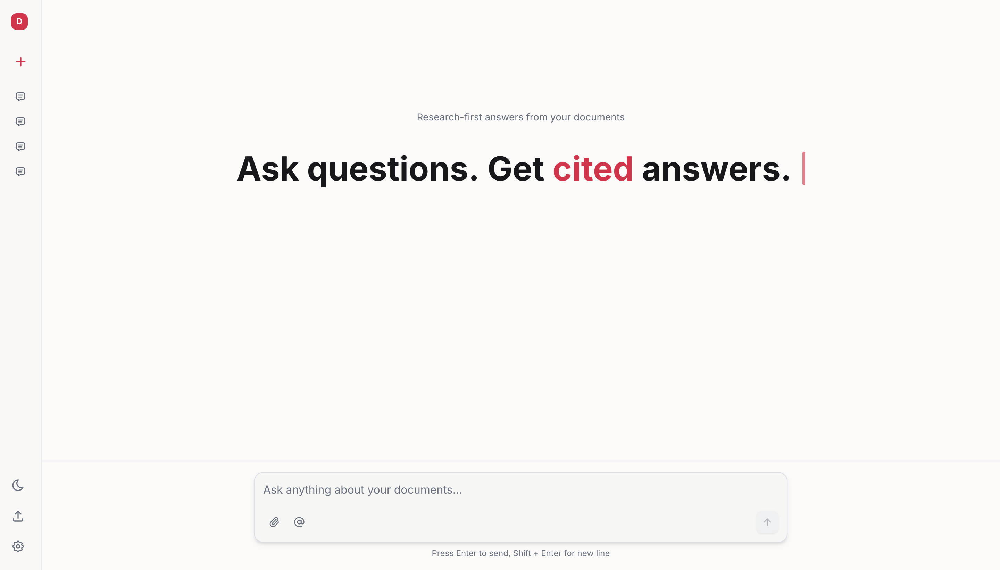
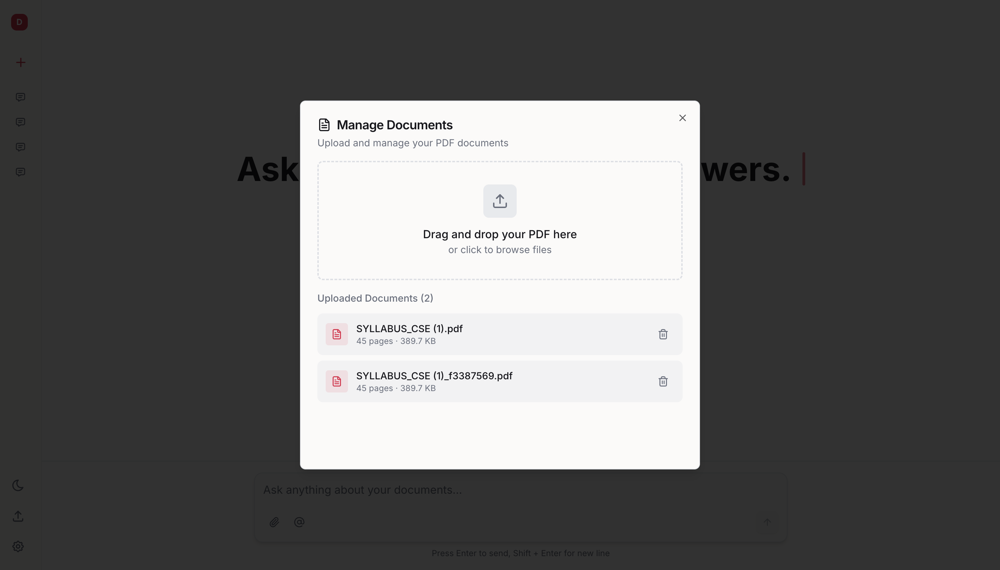
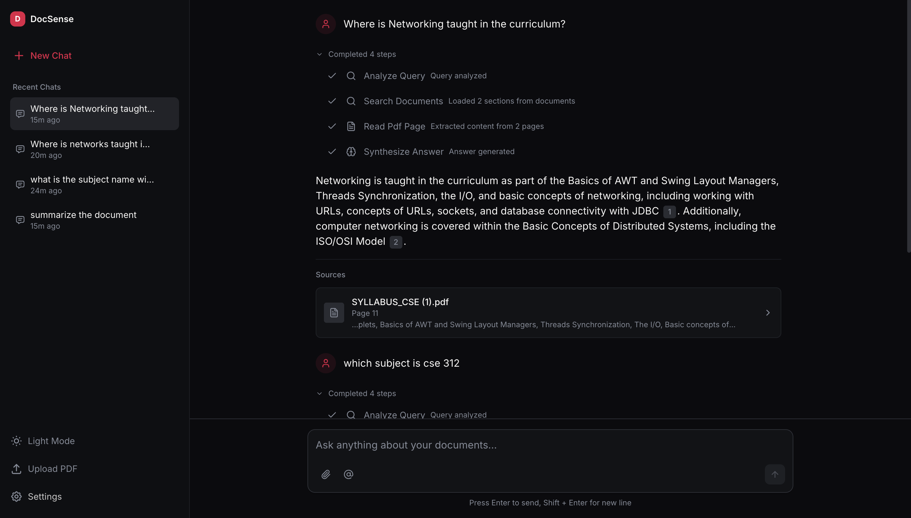
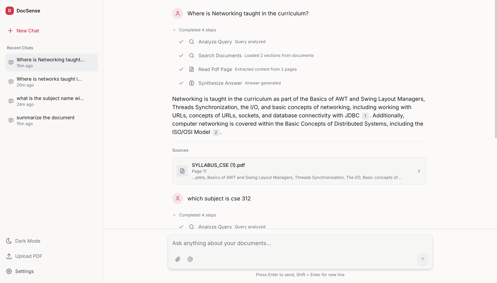
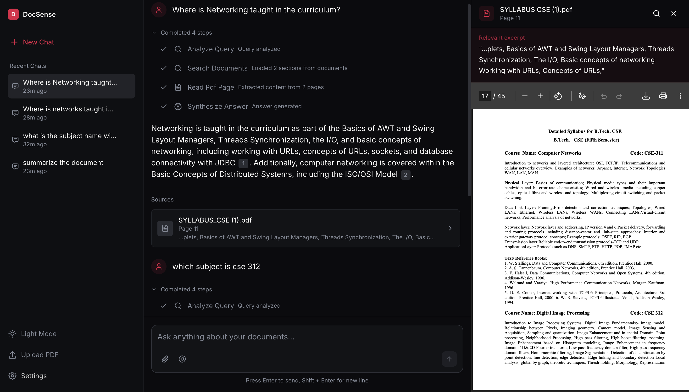

# DocSense - Ask questions. Get cited answers.

<div align="center">


**A research-first application that answers questions directly from your documents with page-level citations.**

[](https://nextjs.org/)
[](https://fastapi.tiangolo.com/)
[](https://www.typescriptlang.org/)
[](https://redis.io/)

[Demo Video](#demo) • [Features](#key-features) • [Quick Start](#quick-start) • [Architecture](#architecture)

</div>

---

## Demo

### Video Walkthrough

> **[Watch the full demo on Google Drive](YOUR_DRIVE_LINK_HERE)**

### Screenshots

<table>
  <tr>
    <td align="center" width="50%">
      
      <br />
      <em>Welcome Screen - Light Mode</em>
    </td>
    <td align="center" width="50%">
      
      <br />
      <em>Upload & Manage Documents</em>
    </td>
  </tr>
  <tr>
    <td align="center" width="50%">
      
      <br />
      <em>Chat Interface - Dark Mode</em>
    </td>
    <td align="center" width="50%">
      
      <br />
      <em>Chat Interface - Light Mode</em>
    </td>
  </tr>
  <tr>
    <td align="center" colspan="2">
      
      <br />
      <em>Split View - Click citation to view exact PDF page</em>
    </td>
  </tr>
</table>

---

## What is DocSense?

**DocSense** is an AI-powered research assistant that lets you ask questions about your documents and get precise answers with page-level citations. Unlike generic chatbots, DocSense prioritizes accuracy and traceability - every answer points you back to the exact source.

### Key Features

- **Natural Language Queries** - Ask questions about your documents conversationally
- **Page-Level Citations** - Every answer includes `[1] [2]` citations linking to exact pages
- **Real-Time Streaming** - Watch answers generate with reasoning steps visible
- **PDF Viewer** - Click any citation to see the source with smooth animations
- **Multi-Document Search** - Upload and query across multiple PDFs
- **Dark/Light Mode** - Professional interface with balanced color scheme

---

## Quick Start

### Option 1: Docker Compose (Recommended)

```bash
# Clone the repository
git clone https://github.com/AC12arpitChauhan/DocSenseAI.git
cd DocSenseAI

# Create .env file with your Gemini API key
echo "GOOGLE_API_KEY=your-gemini-api-key" > .env

# Start all services
docker-compose up --build

# Access the app
open http://localhost:3000
```

### Option 2: Manual Setup

#### Prerequisites

- Node.js 18+
- Python 3.11+
- Redis Server

#### Backend Setup

```bash
cd backend

# Create virtual environment
python -m venv venv
source venv/bin/activate  # On Windows: venv\Scripts\activate

# Install dependencies
pip install -r requirements.txt

# Create environment file
cp .env.example .env
# Edit .env and add your GOOGLE_API_KEY

# Start Redis (in separate terminal)
redis-server

# Start FastAPI server
uvicorn app.main:app --reload --host 0.0.0.0 --port 8000

# Start worker (in separate terminal)
python -m app.queue.worker
```

#### Frontend Setup

```bash
cd frontend

# Install dependencies
npm install

# Start development server
npm run dev

# Access the app
open http://localhost:3000
```

---

## Architecture

```
┌─────────────────┐     ┌─────────────────┐     ┌─────────────────┐
│                 │ SSE │                 │     │                 │
│   Next.js 14    │◄────│    FastAPI      │◄────│   Redis Queue   │
│   Frontend      │     │    Backend      │     │   (RQ Worker)   │
│                 │     │                 │     │                 │
└────────┬────────┘     └────────┬────────┘     └────────┬────────┘
         │                       │                       │
         │                       │                       │
         ▼                       ▼                       ▼
    React + Zustand         Pydantic Models         LangGraph Agent
    Framer Motion           SSE Streaming           Gemini AI Model
    TailwindCSS             PDF Processing          Tool Execution
```

### How It Works

1. **Upload PDFs** - Documents are processed and indexed for search
2. **Ask a Question** - Your query is analyzed and relevant sections are found
3. **Get Cited Answers** - AI generates an answer with inline citations `[1]`
4. **Verify Sources** - Click any citation to view the exact PDF page

---

## Environment Variables

### Backend (`.env`)

| Variable | Description | Default |
|----------|-------------|---------|
| `GOOGLE_API_KEY` | Google Gemini API key | **Required** |
| `REDIS_URL` | Redis connection URL | `redis://localhost:6379` |
| `PDF_DIRECTORY` | Path to PDF storage | `./pdfs` |
| `LOG_LEVEL` | Logging level | `INFO` |

---

## Project Structure

```
DocSense/
├── frontend/                 # Next.js 14 Application
│   ├── app/                  # App Router pages
│   ├── components/           # React components
│   ├── stores/               # Zustand state management
│   └── lib/                  # Utilities
│
├── backend/                  # FastAPI Application
│   ├── app/
│   │   ├── api/              # REST + SSE endpoints
│   │   ├── langgraph/        # AI agent with tools
│   │   ├── pdf/              # PDF extraction
│   │   ├── queue/            # RQ worker
│   │   └── streaming/        # Redis pub/sub
│   └── pdfs/                 # Document storage
│
├── docker-compose.yml        # One-command startup
└── README.md
```

---

## Technology Stack

### Frontend
- **Next.js 14+** - React framework with App Router
- **TypeScript** - Type-safe development
- **Zustand** - State management with persistence
- **Framer Motion** - Smooth animations
- **TailwindCSS** - Utility-first styling
- **shadcn/ui** - UI components

### Backend
- **FastAPI** - High-performance API
- **LangGraph** - AI agent orchestration
- **LangChain + Gemini** - LLM integration
- **Redis Queue (RQ)** - Async job processing
- **PyPDF2** - PDF text extraction

---

## License

MIT License - See [LICENSE](LICENSE) for details.

---

<div align="center">

**DocSense** - *Ask questions. Get cited answers.*

Built with Next.js, FastAPI, and Gemini AI

</div>
